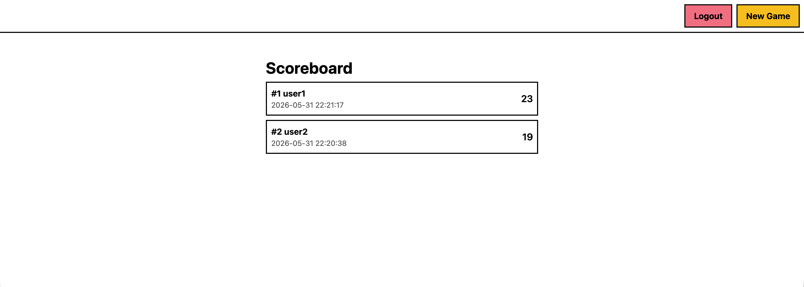
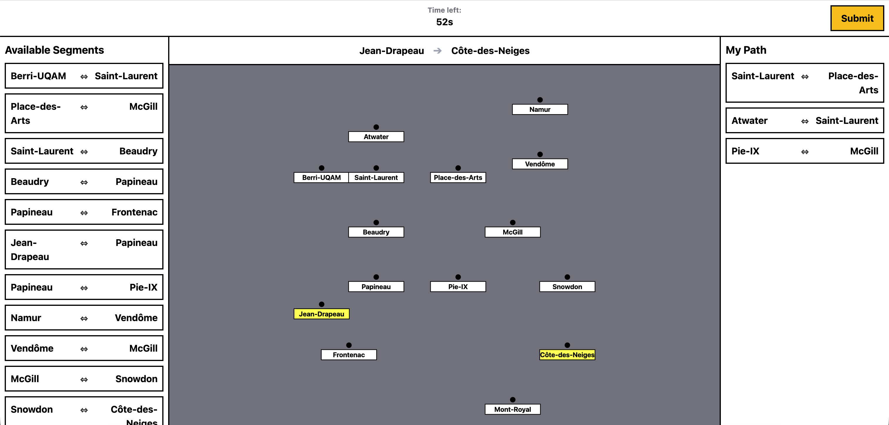

# Exam #1: "Last Race"

## Student: s350155 TRAHAN ADRIEN

## React Client Application Routes

- Route `/`: Home page that offers the option to login and view the scoreboard for logged in users.
- Route `/game/setup`: Displays the full map for the user to study before starting and shows the instructions.
- Route `/game/planning`: Shows the map without lines, start/end stations, and UI to build a route under a time limit.
- Route `/game/execution`: Shows the step-by-step resolution of the route with random events.
- Route `/game/results`: Displays the final score and options to restart or go home.

## API Server

- POST `/api/auth/register/user`
    - Request body: `{ "username": "...", "password": "..." }`
    - Response: `{ "id": 1, "username": "user", "registration_date": "2026-06-01" }`
- POST `/api/auth/login/user`
    - Request body: `{ "username": "...", "password": "..." }`
    - Response: `{ "id": 1, "username": "user", "registration_date": "2026-06-01" }`
- GET `/api/auth/`
    - Request body: None
    - Response: `{ "id": 1, "username": "user", "registration_date": "..." }` or `null` if not authenticated.
- DELETE `/api/auth/`
    - Request body: None
    - Response: Empty (logs out the user).
- POST `/api/game/`
    - Request body: None
    - Response: Newly created game object `{ "id": 1, "map": { ... }, "score": 20, "isOver": 0, "wasSolved": 0, ... }`.
- POST `/api/game/launch`
    - Request body: `{ "gameId": 1 }`
    - Response: Game object with assigned `startStationId` and `endStationId`.
- POST `/api/game/answer`
    - Request body: `{ "gameId": 1, "answer": [1, 5, 12] }` (array of segment IDs)
    - Response: `{ "game": { ...updated_game... }, "events": [ { "event": { "description": "...", "effect": 2 }, "answer": 1 } ] }`.
- GET `/api/game/`
    - Request body: None
    - Response: `{ "games": [ ...list of finished games for the user... ] }`.

## Database Tables

- Table `users` - Stores registered users' credentials (username, hashed password, salt) and registration date.
- Table `maps` - Tracks instantiated maps.
- Table `stations` - Stores station details (`id`, `map_id`, `name`, `x`, `y` coordinates).
- Table `segments` - Stores subway line segments connecting two stations (`id`, `map_id`, `line`, `first_station_id`, `second_station_id`).
- Table `events` - Stores the random events and their effect on the score (`id`, `description`, `effect`).
- Table `games` - Stores the state of games including score, start/end stations, completion status, and user association.

## Main React Components

- `Router` (in `Router.jsx`): Defines all the routes and nested routes for the application.
- `AuthProvider` (in `providers/auth-provider.jsx`): Manages and provides the user's authentication state globally.
- `GameProvider` (in `providers/game-provider.jsx`): Manages the current game state, score, and API interactions for the active game.
- `App` (in `pages/App.jsx`): The landing page component holding the instructions and login forms.
- `ConnectionPanel` (in `components/ConnectionPanel.jsx`): Form for handling user login and registration.
- `InstructionPanel` (in `components/InstructionPanel.jsx`): Displays rules for anonymous users or past game results/ranking for logged-in users.
- `NetworkMap` (in `components/NetworkMap.jsx`): Core SVG component rendering the subway network and its stations.
- `Game` (in `pages/game/Index.jsx`): Wrapper layout for all game phases.
- `Setup` (in `pages/game/setup/Index.jsx`): Component managing the initial map preview phase.
- `Planning` (in `pages/game/planning/Index.jsx`): Component handling the 90-second countdown and route building logic.
- `Execution` (in `pages/game/execution/Index.jsx`): Component playing back the step-by-step events of the journey.
- `Results` (in `pages/game/results/Index.jsx`): Component displaying the final outcome.

## Screenshot

## Users Credentials

- user1, password1
- user2, password2
- user3, password3

## Use of AI Tools

AI was used to write this readme, the content of the instructions panel, to implement the zoom on the network map and the usage of the crypto module for hashing the passwords. The generated code has been tested and verified by me. Windsurf was used as a code completion tool. The rest of the logic was implemented by me.
